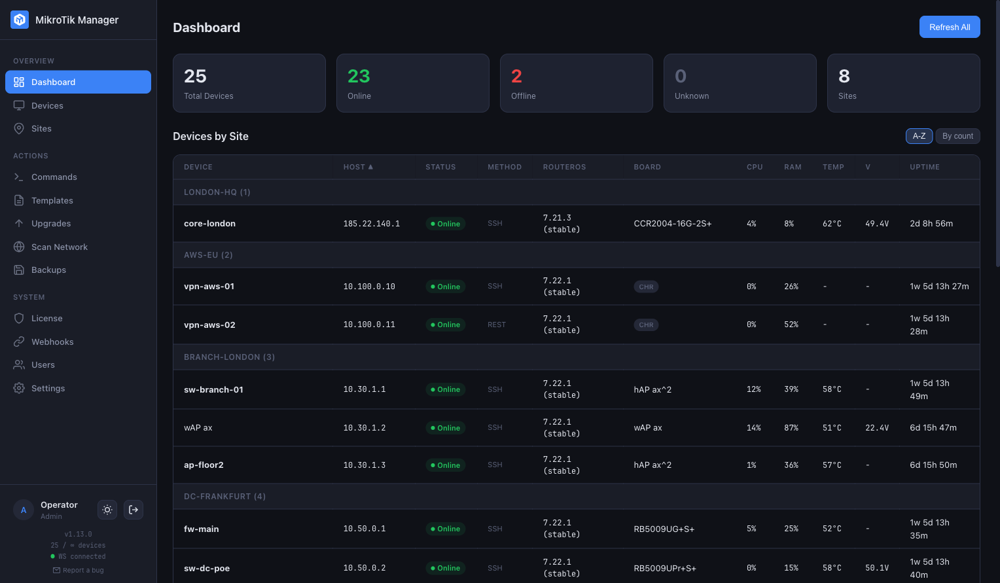
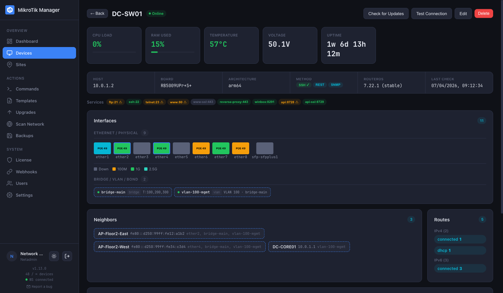
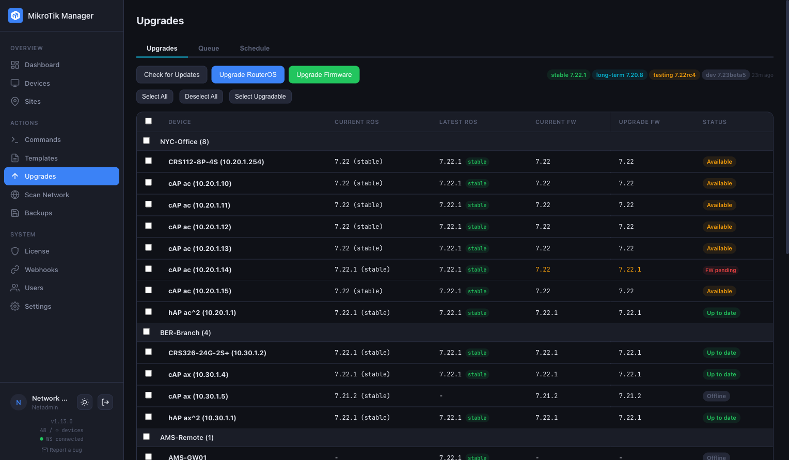
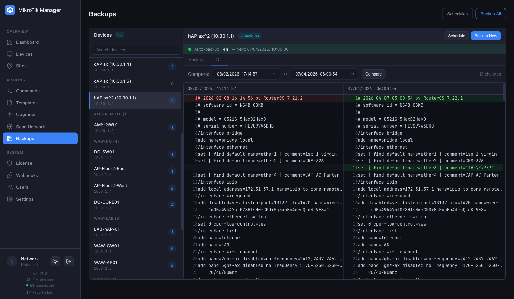

# MikroTik Manager

Self-hosted web application for managing MikroTik device fleets. Monitor, configure, upgrade, and backup your devices from a single dashboard with real-time WebSocket updates.

[](https://github.com/hreskiv/mikr/releases)
[](https://ghcr.io/hreskiv/mikr)

## Screenshots

<p align="center">
  
</p>

<details>
<summary>More screenshots</summary>

<p align="center">
  
</p>

<p align="center">
  
</p>

<p align="center">
  
</p>

</details>

## Features

### Monitoring
- **Real-time dashboard** — device status cards with WebSocket live updates (60s polling, configurable per device)
- **SNMP monitoring** — lightweight SNMPv2c polling (CPU, memory, uptime, temperature, voltage)
- **Three connection methods** — SSH, REST API, or SNMP-only per device
- **SNMP as supplementary** — SSH/REST devices can also use SNMP for faster status checks

### Device Management
- **Site grouping** — organize devices by physical location
- **Device tags** — assign tags with autocomplete, filter by multiple tags (Shift+click)
- **Bulk editing** — select multiple devices, change connection parameters in one action
- **Enable/disable** — disabled devices skip monitoring, dimmed in UI
- **Import from scan** — discover and add devices from network scan results

### Operations
- **Bulk CLI commands** — execute on multiple devices with live WebSocket output
- **RouterOS upgrades** — check for updates + upgrade with real-time progress
- **Firmware upgrades** — write firmware + automatic reboot
- **Config backup & export** — save device configurations to database
- **Side-by-side diff** — compare any two backups visually
- **Backup scheduling** — automated exports with time-of-day selection and flexible intervals (2h to 7d)

### Logging & Observability
- **Built-in syslog receiver (UDP + TCP)** — the Manager ships both UDP and TCP listeners on port `5514` that ingest MikroTik syslog messages, persist them to SQLite, and stream live to the UI over WebSocket. TCP is useful when UDP is blocked by firewalls or when you want guaranteed delivery — RouterOS 7.x supports `Remote Log Protocol: TCP` natively.
- **Native RouterOS format** — topics and messages appear exactly as in `/log print` (works out of the box with `remote-log-format=default`; also accepts `<PRI>`-prefixed and `bsd-syslog=yes` RFC3164 forms)
- **Unified Logs page** — all devices in one stream with colored severity stripe, filters (device, severity, topic, text search), time range selector (`All time` / `Last 1h` / `6h` / `24h` / `7d`), **Load older** pagination, pause and auto-scroll
- **Per-device Logs tab** — focused view on the device detail page for troubleshooting a specific router
- **Multi-IP device correlation** — logs are matched to the right device by **any** interface IP (collected each monitor poll), so the syslog source IP doesn't need to equal the management IP and `src-address=` pinning is optional
- **Per-device retention override** — raise the row cap on chatty core/border routers, lower it on quiet APs, so a log-storm on one device can't evict logs from the rest of the fleet
- **Setup Guide modal** — one click generates a copy-paste MikroTik CLI snippet and an optional **Command Template** to apply the config to every device at once
- **On-device syslog + RouterOS `dstnat` (if running mikr inside a MikroTik Container App)** — see the full install guide at [mikr.app/install.html#container](https://mikr.app/install.html#container)

### Network Discovery
- **IP range scanning** — CIDR, dash ranges, single IP (probes SSH + HTTPS + HTTP)
- **Neighbor discovery** — MNDP / LLDP / CDP with clickable links to managed devices
- **MAC→IPv4 cross-reference** — resolves link-local IPv6 neighbors to real addresses

### Visualization
- **Full interface discovery** — all types: ethernet, SFP, bridge, VLAN, bonding, wireless, WireGuard, EoIP, GRE, PPPoE
- **Grouped interface view** — Ethernet/Physical, CAPsMAN/WiFi, Bridge/VLAN/Bond, Tunnels/VPN, categorized with chips
- **Physical port grid** — colored squares by link speed (10M / 100M / 1G / 10G)
- **PoE indicators** — lightning bolt icon with power, voltage, current in tooltip
- **DHCP leases** — view all leases with IP, MAC, hostname, status badges, and expiry time
- **Wireless clients** — connected clients with signal strength, TX/RX rates, uptime, and IP from DHCP
- **Auto-refresh** — DHCP and wireless tables update every 30s while visible, disconnected clients disappear automatically
- **IPsec tunnels** — configured peers with established/not established state, traffic counters, uptime
- **WireGuard peers** — endpoint, last handshake (color-coded by recency), TX/RX counters
- **IP services** — see all MikroTik services (SSH, API, WWW, Winbox, FTP) as colored pills, toggle enable/disable with safety checks
- **Route counting** — per-protocol breakdown (static, connected, BGP, OSPF, RIP, etc.)

### Security & Access
- **HTTPS / TLS** — optional HTTPS server on port 3443; auto-generated self-signed cert or bring your own; HTTP and HTTPS run in parallel; WebSocket (WSS) works automatically over HTTPS
- **Role-based access** — admin / operator / viewer
- **JWT authentication** — access token (15min) + refresh token (7d)
- **Encrypted passwords** — AES-256-GCM for stored device credentials
- **Dark / Light theme** — toggle in sidebar, persisted in localStorage

## Quick Start

> **Full install guide**, including how to deploy on a **MikroTik Container App** and configure the **RouterOS `dstnat` rule for UDP 5514** (syslog): see [mikr.app/install.html](https://mikr.app/install.html).

```bash
# Pull image
docker pull ghcr.io/hreskiv/mikr:latest

# Create project directory
mkdir -p /opt/mikr/data && cd /opt/mikr

# Create docker-compose.yml
cat > docker-compose.yml << 'EOF'
services:
  mikr:
    image: ghcr.io/hreskiv/mikr:latest
    container_name: mikr-manager
    restart: unless-stopped
    ports:
      - "3000:3000"
      - "3443:3443"    # HTTPS (optional, requires TLS_ENABLED=true)
      - "5514:5514/udp"  # Syslog UDP (optional — omit if not using the Logs page)
      - "5514:5514/tcp"  # Syslog TCP (optional — useful when UDP is blocked)
    volumes:
      - ./data:/app/data
    environment:
      - PORT=3000
      - HOST=0.0.0.0
      - STORAGE_ADAPTER=sqlite
      # JWT_SECRET and ENCRYPTION_KEY are auto-generated on first start and saved
      # to ./data/.secrets.json (mode 0600). Back up the data/ directory!
      # Override here if you want to set your own:
      # - JWT_SECRET=$(openssl rand -hex 48)
      # - ENCRYPTION_KEY=$(openssl rand -hex 32)
EOF

# Start
docker compose up -d

# Create default admin user (first run only)
docker exec mikr-manager node scripts/seed.js
```

Open `http://<host>:3000`, login: **admin** / **admin**

> **Production:** Change the default password immediately. Create a dedicated MikroTik user group with only the required policies instead of using `admin` with full access:
> ```
> /user/group/add name=manager-group policy=ssh,reboot,read,write,sensitive,rest-api,policy,!local,!telnet,!ftp,!test,!winbox,!password,!web,!sniff,api,!romon
> /user/add name=mikr group=manager-group password=YOUR_PASSWORD
> ```
> This limits the blast radius if the manager is compromised.

## Without Docker Compose

```bash
docker pull ghcr.io/hreskiv/mikr:latest
mkdir -p /opt/mikr/data

docker run -d \
  --name mikr-manager \
  --restart unless-stopped \
  -p 3000:3000 \
  -p 5514:5514/udp \
  -p 5514:5514/tcp \
  -v /opt/mikr/data:/app/data \
  -e PORT=3000 \
  -e HOST=0.0.0.0 \
  -e STORAGE_ADAPTER=sqlite \
  ghcr.io/hreskiv/mikr:latest
# JWT_SECRET and ENCRYPTION_KEY are auto-generated and persisted to
# /opt/mikr/data/.secrets.json on first start. To use your own values,
# pass: -e JWT_SECRET=$(openssl rand -hex 48) -e ENCRYPTION_KEY=$(openssl rand -hex 32)

docker exec mikr-manager node scripts/seed.js
```

## Environment Variables

| Variable | Required | Default | Description |
|----------|----------|---------|-------------|
| `JWT_SECRET` | No | auto-generated | Auto-generated on first start, persisted to `data/.secrets.json`. Override by setting env. Generate your own: `openssl rand -hex 48` |
| `ENCRYPTION_KEY` | No | auto-generated | 64 hex chars (32 bytes). Same auto-gen + persist as `JWT_SECRET`. Generate your own: `openssl rand -hex 32` |
| `PORT` | No | `3000` | Server port |
| `HOST` | No | `0.0.0.0` | Bind address |
| `STORAGE_ADAPTER` | No | `sqlite` | Storage backend |
| `LOG_LEVEL` | No | `info` | Log level |
| `MONITOR_INTERVAL_MS` | No | `60000` | Device polling interval (ms) |
| `MONITOR_CONCURRENCY` | No | `10` | Parallel device checks |
| `TLS_ENABLED` | No | `false` | Enable HTTPS server |
| `HTTPS_PORT` | No | `3443` | HTTPS server port |
| `TLS_CERT_PATH` | No | auto-generated | Path to custom TLS certificate (PEM) |
| `TLS_KEY_PATH` | No | auto-generated | Path to custom TLS private key (PEM) |
| `SYSLOG_ENABLED` | No | `true` | Enable the built-in UDP syslog receiver |
| `SYSLOG_PORT` | No | `5514` | UDP port for the syslog listener |
| `SYSLOG_TCP_ENABLED` | No | `true` | Enable the built-in TCP syslog receiver (parallel to UDP) |
| `SYSLOG_TCP_PORT` | No | `5514` | TCP port for the syslog listener (defaults to `SYSLOG_PORT`) |
| `SYSLOG_RETENTION_DAYS` | No | `7` | Drop log rows older than this many days |
| `SYSLOG_MAX_ROWS_PER_DEVICE` | No | `10000` | Global per-device row cap (overridable per device in the UI) |

**Important:** If you rely on auto-generated secrets, **back up `data/.secrets.json`** alongside the SQLite database. Losing it invalidates all sessions and makes stored device passwords unrecoverable. `ENCRYPTION_KEY` must be exactly 64 hex characters — if changed after devices are added, existing encrypted passwords won't decrypt.

## Connection Methods

| Capability | SSH | REST API | SNMP |
|------------|-----|----------|------|
| Status monitoring | ✓ | ✓ | ✓ |
| CLI commands | ✓ | ✓ | — |
| RouterOS upgrades | ✓ | ✓ | — |
| Config backup | ✓ | ✓ | — |
| Interface details | ✓ | ✓ | ✓ |
| Self-signed TLS | N/A | ✓ | N/A |
| Session overhead | 1 SSH conn | HTTPS per request | UDP per poll |

- **SSH** — non-interactive exec, best compatibility with all RouterOS versions
- **REST API** — available on RouterOS 7.1+, supports HTTPS and HTTP
- **SNMP** — monitoring only (no commands, upgrades, or backups). Useful for devices where SSH/REST isn't available

Devices can use SSH or REST as primary method, with SNMP as an optional supplementary source for faster status checks. The device detail page detects available methods from actual service data and allows quick switching between them.

## Licensing

All features are available on every tier — the only difference is the device limit.

| | Community | License 50 | License Unlimited |
|---|-----------|------------|------------------|
| **Devices** | up to 10 | up to 50 | Unlimited |
| **Price** | €0 | €149 (one-time) | €399 (one-time) |
| **Updates** | — | €49/year (optional) | €99/year (optional) |
| **All features** | ✓ | ✓ | ✓ |

- **Perpetual license** — the software works forever on the purchased version
- **Update subscription** — grants access to new versions (optional, not required)
- **Self-hosted** — your data stays on your server, offline license activation
- No account required, no phone-home, no telemetry

## Data & Backup

SQLite database stored in `./data/mikr.db`. Persists across container updates.

```bash
# Backup
cp data/mikr.db mikr-backup.db

# Restore
cp mikr-backup.db data/mikr.db
docker restart mikr-manager
```

## Management

```bash
docker compose logs -f       # View logs
docker compose restart       # Restart
docker compose down          # Stop
docker compose up -d         # Start / update
```

## Tech Stack

- **Backend**: Node.js 22, Express.js, SQLite (better-sqlite3)
- **Frontend**: Vanilla JS SPA (no framework), CSS3
- **Real-time**: WebSocket for live status, command output, upgrade progress
- **Auth**: JWT + bcrypt, role-based (admin / operator / viewer)
- **MikroTik**: SSH (node-ssh) + REST API (https module) + SNMP (net-snmp)
- **Encryption**: AES-256-GCM for stored device passwords
- **Container**: Docker, node:22-alpine (multi-stage build)
